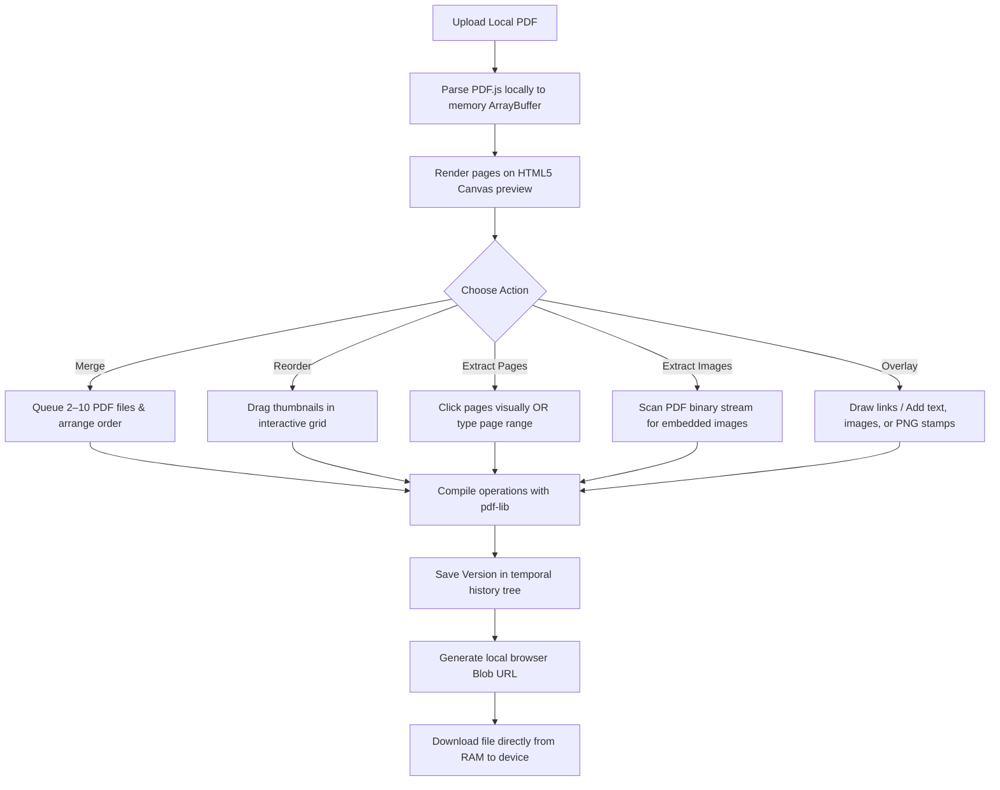

# 🧰 Offline Client-Side PDF Editor

An offline-first, browser-based PDF utility built in React. It runs entirely inside your browser's local sandbox — your documents never leave your device. No cloud servers, no account registration, no subscriptions, and zero tracking.

---

## 🗺️ Product Workflow (Alur Aplikasi)



---

## ⚡ What is the Local Client & How It Works?

### What is it? (Apa itu?)
A **Local Client** architecture means that all computation tasks — document rendering, image processing, and PDF binary modifications — are performed directly on the user's machine inside the browser's execution sandbox. Unlike traditional web apps, there is no backend API processing your files.

### How does it work? (Bagaimana cara kerjanya?)
1. **File Ingestion**: When you load a PDF, the browser reads the file locally via the HTML5 File Reader API, storing it in RAM as an `ArrayBuffer`.
2. **Local Rendering**: The application uses Mozilla's **PDF.js** library to parse and paint page layouts directly onto HTML5 `<canvas>` elements.
3. **Delta Operation Logs**: Edits (page sorting, adding stamps/text) are tracked as lightweight JSON delta frames rather than copying entire PDF blobs — keeping memory usage minimal, especially on mobile.
4. **Client-Side Compilation**: When you hit "Apply & Save", **pdf-lib** applies the queued operations onto the original byte array inside the browser.
5. **Direct RAM Download**: A local `blob:` URI maps to the browser's RAM buffer. When you download, the file is transferred instantly from memory to local storage.

---

## 🎯 Features

### ✂️ Extract Pages
- **Visual page grid**: All PDF pages are rendered as a clickable thumbnail grid.
- **Click-to-select**: Click any page to toggle its selection. A purple checkmark overlay highlights selected pages.
- **Two-way binding**: Selecting pages in the grid auto-updates the `Page Range` text input (e.g. `1, 3-5, 7`), and editing the text field immediately updates the visual checkmarks.
- **Column switcher**: Adjust the grid layout using the `Cols: 1 | 2 | 5 | 10` toggle.

### 🔀 Reorder Pages
- **Drag-and-drop grid**: Drag page thumbnails to rearrange their order using dnd-kit.
- **Fullscreen preview**: Tap/click any page thumbnail to open a high-resolution fullscreen preview modal with Previous/Next navigation.
- **Column switcher**: Adjust the grid layout using the `Cols: 1 | 2 | 5 | 10` toggle.

### 📎 Merge PDFs
- **Multi-file queue**: Load 2–10 PDF files and arrange their order in a sortable list.
- **Column switcher**: View queued files in 1, 2, 5, or 10 column layouts.
- **Smart card layout**: Cards switch between row layout (1–2 cols) and vertical card layout (5–10 cols) to prevent label clipping.

### 🎨 Overlay Editor
- **Links**: Draw clickable hyperlink regions over any page area.
- **Text**: Add text boxes with custom font size and color.
- **Stamps**: Overlay PNG images (e.g. signatures, watermarks) onto pages.
- **Images**: Embed raster images directly onto a page.

### 🖼️ Extract Images
- Scans the PDF binary stream for embedded raster image assets.
- Displays found images in a downloadable thumbnail grid.
- Column switcher: `Cols: 1 | 2 | 5 | 10`.

### 🕐 Version History
- Every "Apply & Save" action creates a snapshot in a Git-like temporal history tree.
- Quickly revert to any earlier version within the same session.

### 🔒 Privacy & Offline
- All operations run inside the browser — zero network requests for file processing.
- Works fully offline as a PWA after the initial page load.

---

## 📊 Feature Comparison Matrix

| Feature / Criteria | 🧰 Offline PDF Editor | 🌐 Online Cloud Tools | 🏢 Adobe Acrobat Pro |
| :--- | :--- | :--- | :--- |
| **Privacy & Security** | 🔒 **100% Secure**: Files never leave your browser. | ⚠️ **Risk**: Files uploaded to third-party servers. | 🏢 **Local / Cloud**: Handled locally or via Adobe Cloud. |
| **Offline Capability** | 📶 **Yes**: Works fully offline as a PWA once loaded. | ❌ **No**: Requires active internet connection. | 💻 **Yes**: Native desktop client. |
| **Subscription Cost** | 🆓 **100% Free**: No paywalls, ads, or usage limits. | 💳 **Freemium**: Limits on size/frequency; paid plans required. | 💰 **Expensive**: High monthly recurring subscription cost. |
| **Installation** | 🌐 **Zero Install**: Open instantly via web URL. | 🌐 **Zero Install**: Web-based but bandwidth heavy. | 💿 **Heavy**: Requires gigabytes of disk space. |
| **Mobile Experience** | 📱 **Mobile-First**: Smooth touch layouts with drag-and-drop. | ⚠️ **Clunky**: Heavy ads, slow uploads on mobile. | 📱 **Native App**: Requires large app store downloads. |
| **Version History** | 🪵 **Git-like version tree**: Track and revert to past states. | ❌ **None**: Single-file outputs with no revert states. | 📝 **Document History**: Basic track-changes log. |
| **Visual Page Selection** | ✅ **Click-to-select grid** with live range sync. | ❌ **Text-input only** in most tools. | ✅ Available in Pro tier. |

---

## 🗣️ Supported Languages (Bahasa yang Tersedia)

The application translates instantly across 12 languages:

| Flag | Language (Local Name) | Language (English Name) | Code | Type |
| :---: | :--- | :--- | :---: | :--- |
| 🇸🇦 | العربية | Arabic | `ar` | Primary |
| 🇨🇳 | 中文 | Chinese | `zh` | Primary |
| 🇬🇧 | English | English | `en` | Primary |
| 🇮🇳 | हिन्दी | Hindi | `hi` | Primary |
| 🇮🇩 | Bahasa Indonesia | Indonesian | `id` | Primary |
| 🇮🇪 | Gaeilge | Irish | `ga` | Primary |
| 🇯🇵 | 日本語 | Japanese | `ja` | Primary |
| 🇮🇩 > 🌾 | Basa Jawa | Javanese | `jv` | Regional / Local |
| 🇲🇾 | Bahasa Melayu | Malay | `ms` | Primary |
| 🇷🇺 | Русский | Russian | `ru` | Primary |
| 🇪🇸 | Español | Spanish | `es` | Primary |
| 🇻🇳 | Tiếng Việt | Vietnamese | `vi` | Primary |

Language can be switched instantly from the language selector in the top navigation bar.

---

## 🖥️ UI & Layout

- **Desktop**: Fixed sidebar layout. The left sidebar is frozen (non-scrolling) while the main content area scrolls independently.
- **Mobile**: Drawer-based navigation with a bottom sheet for tool parameters.
- **Column Grid Toggle**: All page/file grids support `Cols: 1 | 2 | 5 | 10` to adjust density.
- **Fullscreen Page Preview**: Tap any page thumbnail in Reorder mode to open a full-resolution preview modal with Previous/Next navigation.
- **Unsaved Session Warning**: Refreshing or closing the tab while a file is open prompts a browser confirmation dialog to prevent accidental data loss.

---

## 🛠️ Build and Development

### Prerequisites
- Node.js (v18+)
- npm

### Installation
```bash
# Clone the repository
git clone <repository-url>

# Install dependencies
npm install

# Start local development server
npm run dev

# Compile production bundle
npm run build
```

### Tech Stack

| Layer | Library |
| :--- | :--- |
| UI Framework | React 18 + Vite |
| PDF Rendering | PDF.js (Mozilla) |
| PDF Manipulation | pdf-lib |
| Drag & Drop | dnd-kit |
| Styling | Tailwind CSS |

---

## 📄 License

This project is open-source. Contributions and forks are welcome.
