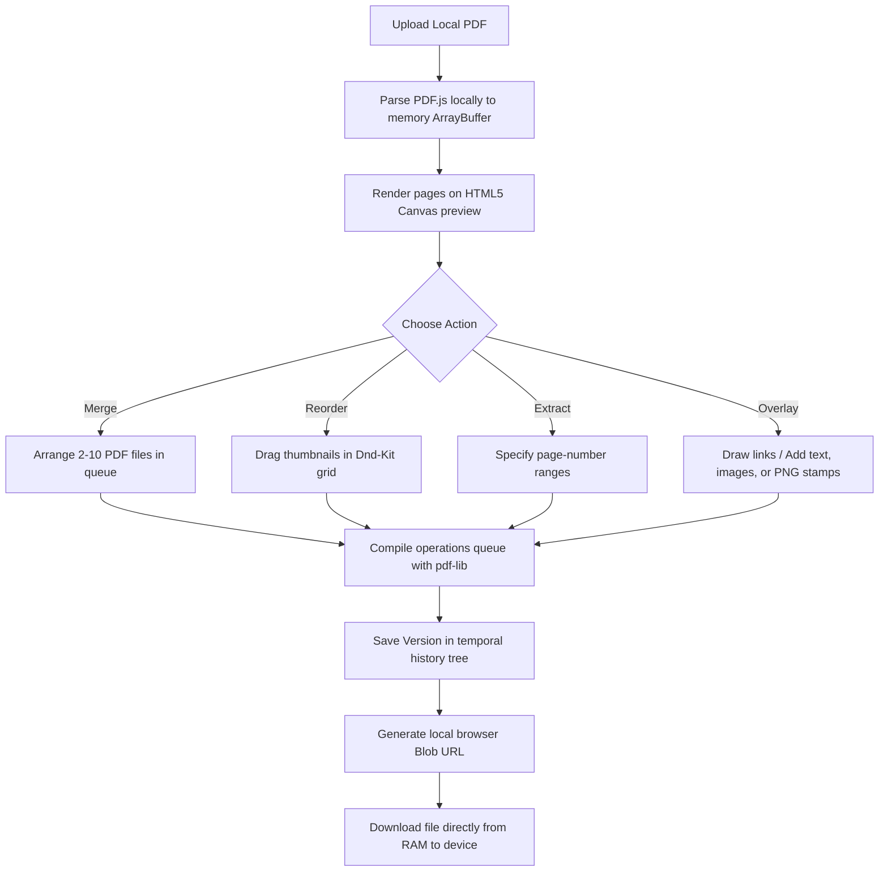

# 🧰 Offline Client-Side PDF Editor

An offline-first, browser-based PDF utility built in React. It runs entirely inside your browser's local sandbox—your documents never leave your device. No cloud servers, no account registration, no subscriptions, and zero tracking.

---

## 🗺️ Product Workflow (Alur Aplikasi)



---

## ⚡ What is the Local Client & How It Works?

### What is it? (Apa itu?)
A **Local Client** architecture means that all computation tasks, document rendering, image processing, and PDF binary modifications are performed directly on the user's local machine inside the browser's execution sandbox. Unlike traditional web apps, there is no backend API processing your files.

### How does it work? (Bagaimana cara kerjanya?)
1. **File Ingestion**: When you load a PDF, the browser reads the file locally via the HTML5 File Reader API, storing it in RAM as an `ArrayBuffer`.
2. **Local Rendering**: The application uses Mozilla's **PDF.js** library to parse and paint page layouts directly onto HTML5 `<canvas>` elements for high-performance visualization.
3. **Delta Operation Logs**: To keep memory consumption optimized (especially on mobile devices), edits (e.g. page sorting, adding stamps/text) are tracked as lightweight JSON delta frames rather than copying huge binary PDF blobs.
4. **Client-Side Compilation**: When you preview or hit "Save Version", **pdf-lib** applies the queue of operations onto the original byte array inside the browser cache.
5. **Direct RAM Download**: The application creates a local `blob:` URI mapping directly to the browser's RAM buffer. When you download the file, it is transferred instantly from your memory to your local storage.

---

## 📊 Feature Comparison Matrix

Here is how our Client-Side Offline PDF Editor compares against online tools (e.g. ILovePDF, SmallPDF) and native desktop suites (Adobe Acrobat Pro):

| Feature / Criteria | 🧰 Offline PDF Editor (Our App) | 🌐 Online Cloud Tools | 🏢 Adobe Acrobat Pro |
| :--- | :--- | :--- | :--- |
| **Privacy & Security** | 🔒 **100% Secure**: Files never leave your browser sandbox. | ⚠️ **Risk**: Files uploaded to third-party cloud servers. | 🏢 **Local / Cloud**: Handled locally or uploaded to Adobe Cloud. |
| **Offline Capability** | 📶 **Yes**: Works fully offline as a PWA once loaded. | ❌ **No**: Requires active high-speed internet connection. | 💻 **Yes**: Native desktop client. |
| **Subscription Cost** | 🆓 **100% Free**: No paywalls, ads, or usage limits. | 💳 **Freemium**: Limits size/frequencies; requires paid plans. | 💰 **Expensive**: High monthly recurring subscription cost. |
| **Installation** | 🌐 **Zero Install**: Open instantly via web URL. | 🌐 **Zero Install**: Web-based but bandwidth heavy. | 💿 **Heavy**: Requires gigabytes of disk space and updates. |
| **Mobile Experience** | 📱 **Mobile-First**: Smooth touch layouts with drag-and-drop. | ⚠️ **Clunky**: Heavy ads, slow uploads/downloads on mobile. | 📱 **Native App**: Requires downloading large app store applications. |
| **Version History** | 🪵 **Git-like version tree**: Track and edit past versions. | ❌ **None**: Standard single-file outputs with no revert states. | 📝 **Document History**: Basic track-changes logs. |

---

## 🎯 Who is this for? (Untuk Siapa?)

- **Privacy-Conscious Professionals**: Lawyers, financial advisors, researchers, and medical staff handling sensitive documents (NDAs, medical records, financial audits) that are forbidden from being uploaded to external cloud systems.
- **On-the-Go Mobile Users**: Anyone needing to quickly merge sheets, reorder page orders, add custom text boxes, or stamp signatures directly from their mobile phone without downloading native apps.
- **Workers with Unstable Internet**: Users in remote locations, planes, or construction sites who need reliable document editing capabilities without internet access.

---

## 🗣️ Supported Languages (Bahasa yang Tersedia)

The application translates instantly across 12 languages:

| Flag Indicator | Language (Local Name) | Language (English Name) | Code | Type |
| :--- | :--- | :--- | :--- | :--- |
| 🇸🇦 | العربية | Arabic | `ar` | Primary |
| 🇨🇳 | 中文 | Chinese | `zh` | Primary |
| 🇬🇧 | English | English | `en` | Primary |
| 🇮🇳 | हिन्दी | Hindi | `hi` | Primary |
| 🇮🇩 | Bahasa Indonesia | Indonesian | `id` | Primary |
| 🇮🇪 | Gaeilge | Irish | `ga` | Primary |
| 🇯🇵 | 日本語 | Japanese | `ja` | Primary |
| 🇮🇩 > 🌾 | Basa Jawa | Javanese | `jv` | Regional / Local |
| 🇲🇾 | Bahasa Melayu | Malay | `ms` | Primary |
| 🇷🇺 | Русский | Russian | `ru` | Primary |
| 🇪🇸 | Español | Spanish | `es` | Primary |
| 🇻🇳 | Tiếng Việt | Vietnamese | `vi` | Primary |

---

## 🛠️ Build and Development

### Prerequisites
- Node.js (v18+)
- npm

### Installation
```bash
# Clone the repository
git clone <repository-url>

# Install dependencies
npm install

# Start local development server
npm run dev

# Compile production bundle
npm run build
```
